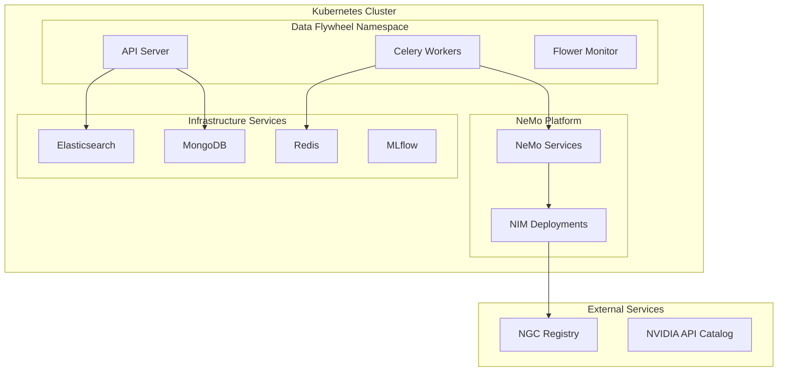

# Production Deployment and Operations Guide

Learn how to deploy and operate the Data Flywheel Blueprint in production environments using Kubernetes, with comprehensive monitoring, scaling, and disaster recovery strategies.

> **📖 For prerequisites and system requirements:** Refer to [System Requirements](03-configuration.md#system-requirements)
> **📖 For environment setup:** Refer to [Environment Variables](03-configuration.md#environment-variables)

## Production Architecture Overview

The Data Flywheel Blueprint supports production deployment on Kubernetes clusters. The following architecture shows how components work together:



## Kubernetes Deployment

> **📖 For complete Helm installation guide:** Refer to [Helm Installation Guide](11-helm-installation.md)
> **📖 For Helm prerequisites and environment setup:** Refer to [Prerequisites](11-helm-installation.md#prerequisites) and [Environment Verification](11-helm-installation.md#environment-verification)

### Helm Chart Structure

**Source**: `deploy/helm/data-flywheel/`

The production deployment uses Helm charts with 14 Kubernetes manifest templates:

```text
deploy/helm/data-flywheel/
├── Chart.yaml                    # Helm chart metadata
├── values.yaml                   # Default configuration values
├── templates/
│   ├── _helpers.tpl               # Helm template helpers
│   ├── api-deployment.yaml       # FastAPI server deployment
│   ├── api-service.yaml          # API service exposure
│   ├── celeryParentWorker-deployment.yaml  # Main worker
│   ├── celeryWorker-deployment.yaml        # Additional workers
│   ├── config-configmap.yaml     # Configuration management
│   ├── secrets.yaml              # Sensitive data management
│   ├── flower-deployment.yaml    # Task monitoring UI
│   ├── flower-service.yaml       # Flower service
│   ├── kibana-deployment.yaml    # Log visualization
│   ├── kibana-service.yaml       # Kibana service
│   ├── mlflow-deployment.yaml    # Experiment tracking deployment
│   ├── mlflow-service.yaml       # MLflow service
│   └── volcano-install.yaml      # Job scheduling
```

> **📖 For detailed installation steps:** Refer to [Chart Installation](11-helm-installation.md#installation-process)
> **📖 For troubleshooting deployment issues:** Refer to [Troubleshooting](11-helm-installation.md#troubleshooting)

### Production Configuration

**Source**: `deploy/helm/data-flywheel/values.yaml:1-505`

#### Core Production Settings

Configure these settings for a production-ready setup:

- Enable the production profile: `profile.production.enabled=true`.
- Enable MLflow: `profile.mlflow.COMPOSE_PROFILES=mlflow`.
- Specify the namespace.
- Set API keys in the `secrets` section (set at runtime during the helm installation script, not in the file).

```yaml
# Production profile - disables development tools
profile:
  production:
    enabled: true  # Disables Kibana and Flower in production
  mlflow:
    COMPOSE_PROFILES: "mlflow"

# Namespace isolation
namespace: "nv-nvidia-blueprint-data-flywheel"

# Secrets values - set these during deployment
# Example: helm install data-flywheel . \
#   --set secrets.ngcApiKey=$NGC_API_KEY
#   ...
# Note: If you don't want to set these via command line during helm install, you must create the Kubernetes secrets manually first.
secrets:
  ngcApiKey: ""  # Set this to your NGC API key
  nvidiaApiKey: "" # Set this to your NVIDIA API key
  hfToken: "" # Set this to your HF token
  llmJudgeApiKey: "" # Set this to your LLM Judge API key (optional)
  embApiKey: "" # Set this to your Embedding API key (optional)
```

#### Default Configuration (from `values.yaml`)

Here is the default configuration; you can use these values if you want to revert your changes to this default:

```yaml
# Data Flywheel server configuration
foundationalFlywheelServer:
  image:
    repository: nvcr.io/nvidia/blueprint/foundational-flywheel-server
    tag: "0.3.0"
  
  deployments:
    # API is the main service that handles requests and returns responses
    api:
      # API is enabled by default and must be enabled to use the flywheel server
      enabled: true
      fullnameOverride: "df-api"
      service:
        type: NodePort
        port: 8000
      ...
    # celeryWorker handles the tasks
    celeryWorker:
      # celeryWorker is enabled by default and must be enabled to use the flywheel server
      enabled: true
      fullnameOverride: "df-celery-worker"
      ...
    # celeryParentWorker orchestrates tasks to celeryWorker
    celeryParentWorker:
      # celeryParentWorker is enabled by default and must be enabled to use the flywheel server
      enabled: true
      fullnameOverride: "df-celery-parent-worker"
      ...
    # mlflowServer is the server that handles the mlflow server
    # (Check if mlflow is enabled in the section `profile.mlflow.COMPOSE_PROFILES`)
    mlflow:
      fullnameOverride: "df-mlflow"
      image: ghcr.io/mlflow/mlflow:v2.22.0
      service:
        type: NodePort
        port: 5000
      ...

# NeMo microservices configuration
nemo-microservices-helm-chart:
  enabled: true

  existingSecret: ngc-api
  existingImagePullSecret: nvcrimagepullsecret
```

#### Helm Chart Override Values

👉 Copy the content below into a new file named `override-values.yaml`:

```bash
foundationalFlywheelServer:
  config:
    nmp_config:
      nemo_base_url: "http://ingress-nginx-controller.ingress-nginx:80"
      nim_base_url: "http://nemo-nim-proxy:8000"
      datastore_base_url: "http://nemo-data-store:3000"

nemo-microservices-helm-chart:
  customizer:
    modelsStorage:
      storageClassName: "local-path"
    workspaceStorage:
      enabled: false
      storageClassName: "local-path"
    customizerConfig:
      training:
        pvc:
          storageClass: "local-path"
  
  deployment-management:
    deployments:
      defaultStorageClass: "local-path"

  ingress: null
  ingress:
    enabled: true
    className: ""
    tls: []
    hosts:
      default:
        name: ""
        paths:
          - path: /v1/namespaces
            pathType: Prefix
            service: nemo-entity-store
            port: 8000
          - path: /v1/projects
            pathType: Prefix
            service: nemo-entity-store
            port: 8000
          - path: /v1/datasets
            pathType: Prefix
            service: nemo-entity-store
            port: 8000
          - path: /v1/repos
            pathType: Prefix
            service: nemo-entity-store
            port: 8000
          - path: /v1/models
            pathType: Prefix
            service: nemo-entity-store
            port: 8000
          - path: /v1/customization
            pathType: Prefix
            service: nemo-customizer
            port: 8000
          - path: /v1/evaluation
            pathType: Prefix
            service: nemo-evaluator
            port: 7331
          - path: /v1/guardrail
            pathType: Prefix
            service: nemo-guardrails
            port: 7331
          - path: /v1/deployment
            pathType: Prefix
            service: nemo-deployment-management
            port: 8000
```

> **💡 Tips:** To find your appropriate storage class name, run `kubectl get storageclass` and choose the default one.

### Volcano Installation

> **📖 For detailed Volcano setup:** Refer to [Volcano Installation](11-helm-installation.md#step-5-volcano-installation)

Install Volcano scheduler before installing the chart:
```bash
kubectl apply -f https://raw.githubusercontent.com/volcano-sh/volcano/v1.9.0/installer/volcano-development.yaml
```

After installing the Volcano scheduler, verify that the `volcano-monitoring` and `volcano-system` namespaces exist:

```bash
$ kubectl get namespaces
NAME                                STATUS   AGE
default                             Active   17m
ingress-nginx                       Active   17m
kube-node-lease                     Active   17m
kube-public                         Active   17m
kube-system                         Active   17m
nv-nvidia-blueprint-data-flywheel   Active   17m
volcano-monitoring                  Active   16m  👈
volcano-system                      Active   16m  👈
```


### Helm Chart Installation Process

> **📖 For complete installation process:** Refer to [Chart Installation](11-helm-installation.md#step-6-chart-installation)
> **📖 For environment preparation:** Refer to [Environment Preparation](11-helm-installation.md#step-1-environment-preparation)
> **📖 For post-installation setup:** Refer to [Post-Installation Setup](11-helm-installation.md#post-installation-setup)

```bash
# Basic production deployment
helm install data-flywheel ./deploy/helm/data-flywheel \
  --namespace nv-nvidia-blueprint-data-flywheel \
  --create-namespace \
  --set secrets.ngcApiKey=$NGC_API_KEY \
  --set secrets.nvidiaApiKey=$NVIDIA_API_KEY \
  --set secrets.hfToken=$HF_TOKEN \
  --set secrets.llmJudgeApiKey=$LLM_JUDGE_API_KEY \
  --set secrets.embApiKey=$EMB_API_KEY \
  -f ./deploy/helm/data-flywheel/override-values.yaml
```

> **💡 Production Tips:**
>
> - For production-specific configuration examples, refer to [Production Environment Configuration](11-helm-installation.md#production-environment-configuration)
> - For scaling and operations guidance, refer to [Operations and Maintenance](11-helm-installation.md#operations-and-maintenance)
