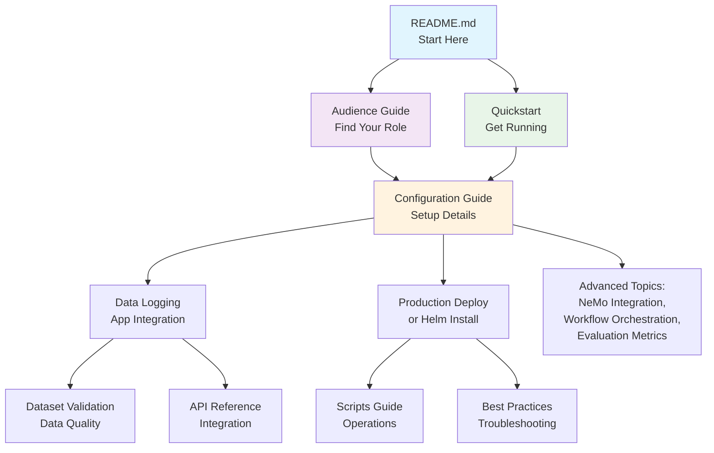

# Data Flywheel Blueprint Documentation

Welcome to the Data Flywheel Blueprint documentation! This guide helps you navigate our comprehensive documentation to find exactly what you need.

## 🚀 Quick Start Paths

### I want to...

**🏃‍♂️ Get up and running quickly**
→ Start with [Getting Started (Quickstart)](02-quickstart.md)

**🔧 Configure for my environment**  
→ Jump to [Configuration Guide](03-configuration.md)

**🏢 Deploy in production**  
→ Go to [Production Deployment](10-production-deployment.md) or [Helm Installation](11-helm-installation.md)

**📊 Understand evaluation results**  
→ Read [Evaluation Types and Metrics](06-evaluation-types-and-metrics.md)

**🔌 Integrate my application**  
→ Check out [Data Logging for AI Apps](data-logging.md)

**🚨 Troubleshoot issues**  
→ See [Limitations & Best Practices](05-limitations-best-practices.md)

---

## 👥 Documentation by Role

### For Leadership & Product Teams
- **Start here:** [Audience Guide - Leadership](04-audience-guide.md#for-leadership-cto-vp-engineering)
- **Key concepts:** [Architecture Overview](01-architecture.md)
- **Success metrics:** [Evaluation Types and Metrics](06-evaluation-types-and-metrics.md)

### For ML Engineers & Researchers  
- **Start here:** [Audience Guide - Researchers](04-audience-guide.md#for-researchers--ml-engineers)
- **Deep dive:** [Configuration Guide](03-configuration.md) → [NeMo Platform Integration](09-nemo-platform-integration.md)
- **Workflow:** [Task Orchestration](08-workflow-orchestration.md)

### For Application Engineers
- **Start here:** [Audience Guide - App Engineers](04-audience-guide.md#for-application-engineers)
- **Implementation:** [Data Logging for AI Apps](data-logging.md) → [Dataset Validation](dataset-validation.md)
- **API integration:** [API Reference](07-api-reference.md)

### For DevOps & Platform Teams
- **Start here:** [Production Deployment](10-production-deployment.md)
- **Installation:** [Helm Installation](11-helm-installation.md)
- **Operations:** [Scripts Guide](scripts.md)

---

## 📚 Complete Documentation Index

### Getting Started
| Document | Purpose | When to Read |
|----------|---------|--------------|
| **[Quickstart](02-quickstart.md)** | End-to-end setup guide | First time setup, demos |
| **[Architecture Overview](01-architecture.md)** | High-level system design | Understanding components |
| **[Audience Guide](04-audience-guide.md)** | Role-specific guidance | Finding your starting point |

### Configuration & Setup  
| Document | Purpose | When to Read |
|----------|---------|--------------|
| **[Configuration Guide](03-configuration.md)** | Complete configuration reference | Setting up models, evaluation, training |
| **[Data Logging for AI Apps](data-logging.md)** | Application instrumentation | Integrating your AI application |
| **[Dataset Validation](dataset-validation.md)** | Data quality requirements | Troubleshooting data issues |

### Advanced Topics
| Document | Purpose | When to Read |
|----------|---------|--------------|
| **[Evaluation Types and Metrics](06-evaluation-types-and-metrics.md)** | Understanding results | Interpreting model performance |
| **[Task Orchestration](08-workflow-orchestration.md)** | Workflow internals | Debugging, customizing workflows |
| **[NeMo Platform Integration](09-nemo-platform-integration.md)** | Advanced NeMo features | Deep NeMo customization |

### Deployment & Operations
| Document | Purpose | When to Read |
|----------|---------|--------------|
| **[Production Deployment](10-production-deployment.md)** | Kubernetes production setup | Production deployments |
| **[Helm Installation](11-helm-installation.md)** | Helm chart deployment | Kubernetes with Helm |
| **[Scripts Guide](scripts.md)** | Utility scripts reference | Development, maintenance |

### Reference & Troubleshooting
| Document | Purpose | When to Read |
|----------|---------|--------------|
| **[API Reference](07-api-reference.md)** | Complete API documentation | Building integrations |
| **[Limitations & Best Practices](05-limitations-best-practices.md)** | Common issues and solutions | Troubleshooting, optimization |

---

## 🗺️ Common Reading Paths

### 🆕 First-Time Users
1. [Architecture Overview](01-architecture.md) *(5 min - understand the big picture)*
2. [Quickstart](02-quickstart.md) *(30 min - get it running)*
3. [Audience Guide](04-audience-guide.md) *(choose your role)*
4. Role-specific deep dive documents

### 🔧 Setting Up for Your Use Case
1. [Configuration Guide](03-configuration.md) *(understand all options)*
2. [Data Logging for AI Apps](data-logging.md) *(instrument your app)*
3. [Dataset Validation](dataset-validation.md) *(ensure data quality)*
4. [API Reference](07-api-reference.md) *(integrate programmatically)*

### 🏢 Production Deployment
1. [Configuration Guide](03-configuration.md) *(plan your setup)*
2. [Production Deployment](10-production-deployment.md) *(deployment architecture)*
3. [Helm Installation](11-helm-installation.md) *(step-by-step install)*
4. [Limitations & Best Practices](05-limitations-best-practices.md) *(avoid common pitfalls)*

### 🔬 Research & Development
1. [NeMo Platform Integration](09-nemo-platform-integration.md) *(advanced features)*
2. [Task Orchestration](08-workflow-orchestration.md) *(workflow customization)*
3. [Evaluation Types and Metrics](06-evaluation-types-and-metrics.md) *(interpret results)*
4. [API Reference](07-api-reference.md) *(programmatic access)*

---

## 🔗 How Documents Connect

---

## 🤝 Getting Help

- **GitHub Issues:** [Report bugs or request features](https://github.com/NVIDIA-AI-Blueprints/data-flywheel/issues)
- **Documentation Issues:** Found something unclear? Let us know!
- **Community:** Join discussions and share experiences

---

**Ready to get started?** Choose your path above or dive into the [Quickstart Guide](02-quickstart.md)! 🚀 